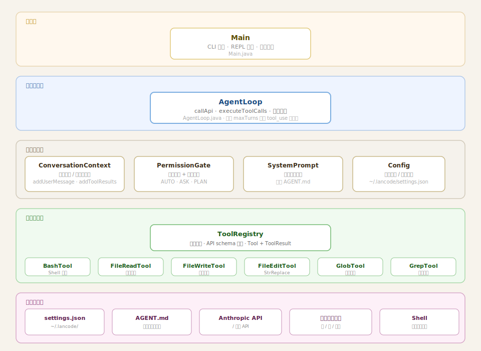
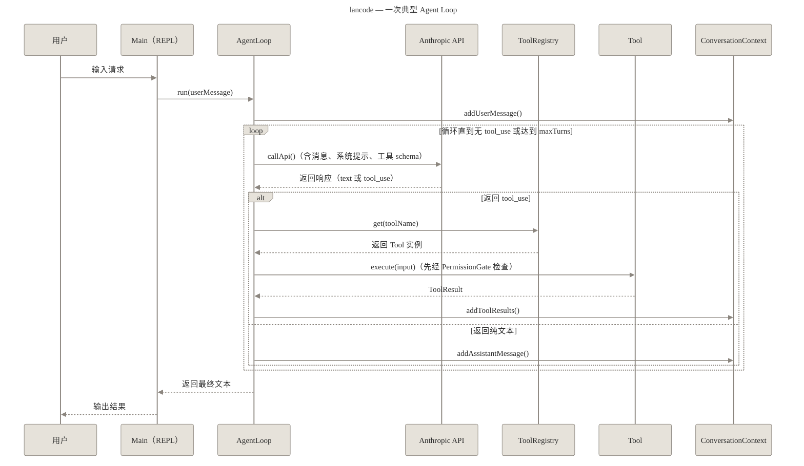
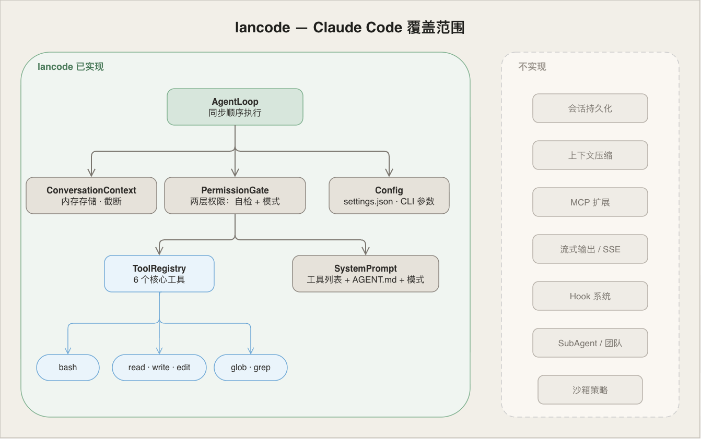

<div align="center">


**用 Java 实现的极简 Claude Code Agent Loop。**

[](https://github.com/LgoLgo/lancode/actions/workflows/ci.yml)
[](https://openjdk.org/projects/jdk/17/)
[](LICENSE)

~900 行。可对接任何 Anthropic 兼容 API。

</div>

---

从 Claude Code 的架构中提炼而来 —— Agent Loop、工具系统、权限模型、上下文管理 —— 剥离到最核心的结构，方便阅读和学习。

## 课程

配套课程逐章解析各子系统的实现原理，适合已有 LLM 基础、想深入了解 Agent Loop 内部机制的工程师。

| 章节 | 内容 | 链接 |
|------|------|------|
| 第一章：Agent Loop | 核心循环逻辑 | [阅读](https://lgolgo.github.io/lancode/01-agent-loop) |
| 第二章：工具系统 | Tool 接口、Registry、6 个内置工具 | [阅读](https://lgolgo.github.io/lancode/02-tool-system) |
| 第三章：权限模型 | PermissionGate 双层检查机制 | [阅读](https://lgolgo.github.io/lancode/03-permission) |
| 第四章：对话上下文 | ConversationContext 消息管理与截断 | [阅读](https://lgolgo.github.io/lancode/04-context) |
| 第五章：系统提示词 | SystemPrompt 组装逻辑 | [阅读](https://lgolgo.github.io/lancode/05-system-prompt) |

## 系统设计

### 架构



### 时序

一次典型 Agent Loop 的执行过程：



循环在模型返回不含 `tool_use` 的响应时退出，或达到 `maxTurns` 上限时终止。

### 实现范围



## 安装

需要 Java 17+ 和 Maven。

```bash
git clone https://github.com/LgoLgo/lancode
cd lancode
mvn package -q -DskipTests
```

## 配置

**官方 Anthropic API**

```bash
mkdir -p ~/.lancode
cat > ~/.lancode/settings.json << 'EOF'
{
  "model": "claude-opus-4-5",
  "apiKey": "sk-ant-...",
  "permissionMode": "AUTO"
}
EOF
```

**第三方兼容 API**（如 LongCat、OpenRouter、自托管服务等）

```bash
mkdir -p ~/.lancode
cat > ~/.lancode/settings.json << 'EOF'
{
  "model": "your-model-name",
  "baseUrl": "https://your-api-endpoint",
  "authToken": "your-key-here",
  "permissionMode": "AUTO"
}
EOF
```

第三方 API 通常使用 `Authorization: Bearer` 认证，应使用 `authToken` 字段。`apiKey` 仅用于官方 Anthropic API（发 `x-api-key` 头）。

未提供配置文件时，从环境变量 `ANTHROPIC_API_KEY` 读取密钥，使用官方 Anthropic 端点。

## AGENT.md

在项目根目录放置 `AGENT.md` 文件，可为 lancode 提供项目专属指令，启动时自动加载并注入系统提示。

```
your-project/
├── AGENT.md        ← lancode 自动读取
└── src/
```

这是 lancode 对 Claude Code `CLAUDE.md` 机制的等价实现——命名为 `AGENT.md` 以区分：这是给 agent 的指令，而非给 Claude Code 工具本身的配置。

## 运行

```bash
# 交互式 REPL
java -jar target/lancode-0.1.0.jar

# 单次执行
java -jar target/lancode-0.1.0.jar "列出当前目录的文件"

# 运行时覆盖配置
java -jar target/lancode-0.1.0.jar --model claude-opus-4-5 --mode ask
```

## REPL 命令

| 命令 | 说明 |
|------|------|
| `/tools` | 列出可用工具 |
| `/mode [ask\|auto\|plan]` | 查看或切换权限模式 |
| `/help` | 显示帮助 |
| `/quit` | 退出 |

## settings.json 字段说明

| 字段 | 默认值 | 说明 |
|------|--------|------|
| `model` | `claude-opus-4-5` | 传给 API 的模型名 |
| `baseUrl` | Anthropic 官方端点 | 自定义 API 地址 |
| `apiKey` | `$ANTHROPIC_API_KEY` | 官方 Anthropic API，发 `x-api-key` 头 |
| `authToken` | — | 第三方 API，发 `Authorization: Bearer` 头 |
| `permissionMode` | `AUTO` | `AUTO` \| `ASK` \| `PLAN` |
| `maxTurns` | `30` | 每条消息最大 Agent Loop 轮数 |
| `maxContextMessages` | `100` | 触发截断前的消息历史上限 |

**权限模式说明**

- `AUTO` — 所有工具自动执行，无需确认
- `ASK` — 不在安全列表中的 bash 命令会提示 `[y/N]`
- `PLAN` — 只读模式；bash、write_file、edit_file 被禁用

## 工具列表

| 工具 | 说明 |
|------|------|
| `bash` | 通过 `ProcessBuilder` 执行 shell 命令 |
| `read_file` | 读取文件内容 |
| `write_file` | 写入或创建文件 |
| `edit_file` | 精确字符串替换（StrReplace） |
| `glob` | 按 glob 模式查找文件 |
| `grep` | 按正则搜索文件内容 |

## 开发

```bash
mvn test                   # 运行测试
mvn compile                # 仅编译
mvn package -DskipTests    # 构建 fat jar
```

测试位于 `src/test/java/com/lancode/tools/`。

## 参考

- [ultraworkers/claw-code](https://github.com/ultraworkers/claw-code)
- [bcefghj/miniClaudeCode](https://github.com/bcefghj/miniClaudeCode)
- Special Thanks: [LinuxDO](https://linux.do/)

## 许可证

Apache 2.0
