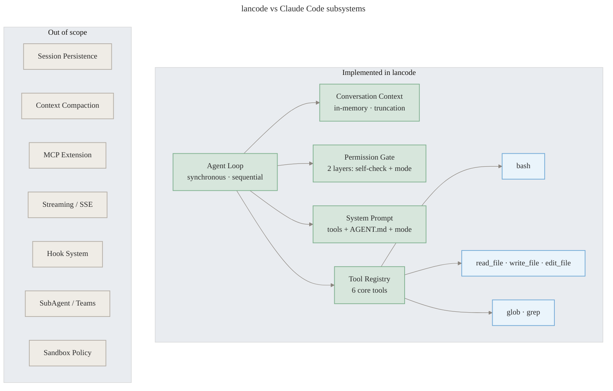

<div align="center">


**A minimal Claude Code agent loop in Java.**

[](https://github.com/LgoLgo/lancode/actions/workflows/ci.yml)
[](https://openjdk.org/projects/jdk/17/)
[](LICENSE)
[](README.zh.md)

~700 lines. Runs against any Anthropic-compatible API.

</div>

---

Distilled from Claude Code's architecture — the agentic loop, tool system, permission model, and context management — stripped to the essential structure.

## What's implemented



## Install

Requires Java 17+ and Maven.

```bash
git clone https://github.com/LgoLgo/lancode
cd lancode
mvn package -q -DskipTests
```

## Configure

**Official Anthropic API**

```bash
mkdir -p ~/.lancode
cat > ~/.lancode/settings.json << 'EOF'
{
  "model": "claude-opus-4-5",
  "apiKey": "sk-ant-...",
  "permissionMode": "AUTO"
}
EOF
```

**Third-party Anthropic-compatible API** (e.g. LongCat, OpenRouter, self-hosted)

```bash
mkdir -p ~/.lancode
cat > ~/.lancode/settings.json << 'EOF'
{
  "model": "your-model-name",
  "baseUrl": "https://your-api-endpoint",
  "authToken": "your-key-here",
  "permissionMode": "AUTO"
}
EOF
```

Use `authToken` instead of `apiKey` for providers that require `Authorization: Bearer` authentication (most third-party proxies). Use `apiKey` only for the official Anthropic API.

All fields are optional. Without a config file, `ANTHROPIC_API_KEY` is read from the environment and the official Anthropic endpoint is used.

## AGENT.md

Place an `AGENT.md` file in your project root to give lancode project-specific instructions. It is loaded automatically at startup and injected into the system prompt.

```
your-project/
├── AGENT.md        ← lancode reads this
└── src/
```

This is lancode's equivalent of Claude Code's `CLAUDE.md` — but named `AGENT.md` to distinguish it as instructions for the agent, not for Claude Code itself.

## Run

```bash
# interactive REPL
java -jar target/lancode-0.1.0.jar

# one-shot
java -jar target/lancode-0.1.0.jar "list files in the current directory"

# override config at runtime
java -jar target/lancode-0.1.0.jar --model claude-opus-4-5 --mode ask
```

## REPL commands

| Command | Description |
|---------|-------------|
| `/tools` | List available tools |
| `/mode [ask\|auto\|plan]` | Show or change permission mode |
| `/help` | Show help |
| `/quit` | Exit |

## settings.json reference

| Field | Default | Description |
|-------|---------|-------------|
| `model` | `claude-opus-4-5` | Model name passed to the API |
| `baseUrl` | Anthropic official | Override API endpoint |
| `apiKey` | `$ANTHROPIC_API_KEY` | For official Anthropic API; sends `x-api-key` header |
| `authToken` | — | For third-party APIs; sends `Authorization: Bearer` header |
| `permissionMode` | `AUTO` | `AUTO` \| `ASK` \| `PLAN` |
| `maxTurns` | `30` | Max agent loop iterations per message |
| `maxContextMessages` | `100` | Message history limit before truncation |

**Permission modes**

- `AUTO` — all tools execute without confirmation
- `ASK` — bash commands not on the safe list prompt `[y/N]`
- `PLAN` — read-only; bash, write_file, and edit_file are blocked

## Tools

| Tool | Description |
|------|-------------|
| `bash` | Execute shell commands via `ProcessBuilder` |
| `read_file` | Read file contents |
| `write_file` | Write or create a file |
| `edit_file` | Replace an exact string in a file (StrReplace) |
| `glob` | Find files by glob pattern |
| `grep` | Search file contents by regex |

## Architecture

```
Main                    CLI entry point, REPL, arg parsing
AgentLoop               Core loop: prompt → API → tool_use → execute → repeat
  ConversationContext   Message list with truncation
  PermissionGate        Two-layer: tool self-check + mode enforcement
  SystemPrompt          Assembles system prompt from tools + AGENT.md + mode
  ToolRegistry          Registers tools, produces API schemas
    Tool (interface)    name / description / inputSchema / execute
    ToolResult (record) output + isError
```

The loop terminates when the model returns a response with no `tool_use` blocks, or when `maxTurns` is reached.

## Development

```bash
mvn test                   # run tests
mvn compile                # compile only
mvn package -DskipTests    # build fat jar
```

Tests live in `src/test/java/com/lancode/tools/`.

## License

Apache 2.0
